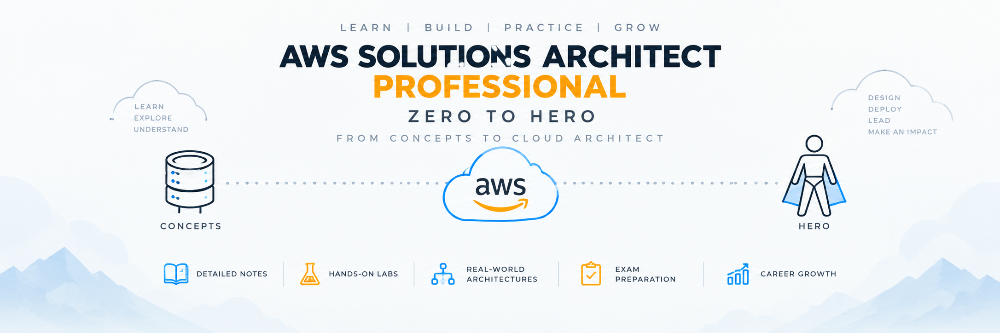

<escape>
<p align="center">
  
</p>

<p align="center">


</p>

# AWS Solutions Architect Professional — Zero to Hero

> From AWS architecture fundamentals to enterprise solution design — comprehensive explanations, architecture patterns, hands-on labs, real-world scenarios, interview preparation, and production-ready projects.

---

# ☁️ About This Repository

**AWS Solutions Architect Professional – Zero to Hero** is a structured, architecture-focused learning repository designed to help you master AWS from beginner to professional level while preparing for the **AWS Certified Solutions Architect – Professional (SAP-C02)** certification.

Unlike traditional certification notes, this repository focuses on:

* Enterprise architecture design
* AWS Cloud Adoption Framework (CAF)
* Landing Zone architecture using AWS Organizations & Control Tower
* AWS Well-Architected Framework
* Production-ready hands-on labs
* Real-world design scenarios
* Architecture diagrams and decision-making
* Interview preparation

Every section is organized into its own folder with a dedicated `README.md` covering architecture concepts, service comparisons, implementation guides, hands-on labs, and production scenarios.

---

# 🎯 Learning Outcomes

By the end of this repository, you'll be able to:

* Translate business and technical requirements into AWS solution architectures.
* Apply the AWS Well-Architected Framework to design secure, reliable, high-performing, and cost-effective solutions.
* Design enterprise Landing Zones using AWS Organizations and Control Tower.
* Apply the AWS Cloud Adoption Framework (CAF) to cloud transformation projects.
* Build secure multi-account governance using Organizational Units, Service Control Policies, IAM Identity Center, and AWS Resource Access Manager.
* Design highly available networking using VPC, Transit Gateway, Direct Connect, VPN, Route 53, CloudFront, Global Accelerator, and PrivateLink.
* Select the appropriate compute platform using EC2, Auto Scaling, ECS, EKS, Lambda, App Runner, and Elastic Beanstalk.
* Design scalable application architectures using APIs, messaging, event-driven patterns, and serverless technologies.
* Choose the right storage and database services for different workload requirements.
* Implement observability using CloudWatch, CloudTrail, AWS Config, X-Ray, and Systems Manager.
* Design disaster recovery strategies using Multi-AZ, Multi-Region, Pilot Light, Warm Standby, and Active-Active architectures.
* Plan enterprise migration and modernization using AWS Migration Hub, Application Migration Service, DMS, SCT, and Snow Family.
* Evaluate architectural trade-offs involving performance, security, reliability, complexity, and cost.
* Build production-ready AWS projects from scratch.

---

# 📚 Repository Contents

This repository follows a structured **Zero-to-Hero roadmap**, progressing from architecture fundamentals to enterprise-scale AWS solution design.

---

# 1. Architecture Fundamentals

This section introduces the core concepts of AWS solution architecture and builds the foundation required for SAP-C02. It focuses on understanding business problems, translating requirements into architecture, evaluating design options, and making decisions based on reliability, security, performance, cost, and operational needs.

📂 **[Explore → Architecture Fundamentals](./01-Architecture-Fundamentals/README.md)**

| #    | Sub-Topic                                                                                                           | Description                                                                                            |
| ---- | ------------------------------------------------------------------------------------------------------------------- | ------------------------------------------------------------------------------------------------------ |
| 1.1  | [Introduction to Solution Architecture](./01-Architecture-Fundamentals/01-Introduction-to-Solution-Architecture.md) | What solution architecture is and how architects translate business problems into technology solutions |
| 1.2  | [AWS Global Infrastructure](./01-Architecture-Fundamentals/02-AWS-Global-Infrastructure.md)                         | Regions, Availability Zones, Local Zones, Edge Locations, and Global Infrastructure                    |
| 1.3  | [Business Requirements](./01-Architecture-Fundamentals/03-Business-Requirements.md)                                 | Functional vs Non-functional requirements                                                              |
| 1.4  | [Architecture Decision Making](./01-Architecture-Fundamentals/04-Architecture-Decision-Making.md)                   | Evaluating alternatives, trade-offs, and decision frameworks                                           |
| 1.5  | [Architecture Quality Attributes](./01-Architecture-Fundamentals/05-Architecture-Quality-Attributes.md)             | Reliability, scalability, security, performance, maintainability, and resiliency                       |
| 1.6  | [AWS Design Principles](./01-Architecture-Fundamentals/06-AWS-Design-Principles.md)                                 | Design for failure, automation, loose coupling, least privilege, and stateless design                  |
| 1.7  | [Architecture Patterns](./01-Architecture-Fundamentals/07-Architecture-Patterns.md)                                 | Monolith, microservices, serverless, event-driven, and API-centric architectures                       |
| 1.8  | [Scalability, Availability & Resiliency](./01-Architecture-Fundamentals/08-Scalability-Availability-Resiliency.md)  | Designing systems that continue operating during failures                                              |
| 1.9  | [Architecture Trade-offs](./01-Architecture-Fundamentals/09-Architecture-Trade-offs.md)                             | Cost vs performance, consistency vs availability, and other architectural trade-offs                   |
| 1.10 | [Architecture Documentation & ADRs](./01-Architecture-Fundamentals/10-Architecture-Documentation-and-ADRs.md)       | Architecture diagrams, logical views, ADRs, and documentation                                          |

---

# 2. AWS Well-Architected Framework

This section explains how AWS recommends designing secure, reliable, high-performing, cost-efficient, and sustainable workloads using the **AWS Well-Architected Framework**.

📂 **[Explore → AWS Well-Architected Framework](./02-AWS-Well-Architected-Framework/README.md)**

| #   | Sub-Topic                                                                                  | Description                                                       |
| --- | ------------------------------------------------------------------------------------------ | ----------------------------------------------------------------- |
| 2.1 | [Framework Overview](./02-AWS-Well-Architected-Framework/01-Framework-Overview.md)         | Introduction to the Well-Architected Framework                    |
| 2.2 | [Operational Excellence](./02-AWS-Well-Architected-Framework/02-Operational-Excellence.md) | Continuous improvement and operational best practices             |
| 2.3 | [Security](./02-AWS-Well-Architected-Framework/03-Security.md)                             | Identity, detection, infrastructure protection, and data security |
| 2.4 | [Reliability](./02-AWS-Well-Architected-Framework/04-Reliability.md)                       | Recovery, fault tolerance, and resiliency                         |
| 2.5 | [Performance Efficiency](./02-AWS-Well-Architected-Framework/05-Performance-Efficiency.md) | Selecting efficient resources and optimizing workloads            |
| 2.6 | [Cost Optimization](./02-AWS-Well-Architected-Framework/06-Cost-Optimization.md)           | Eliminating unnecessary expenses                                  |
| 2.7 | [Sustainability](./02-AWS-Well-Architected-Framework/07-Sustainability.md)                 | Designing environmentally responsible workloads                   |
| 2.8 | [Well-Architected Tool](./02-AWS-Well-Architected-Framework/08-Well-Architected-Tool.md)   | Reviewing workloads using AWS Well-Architected Tool               |

---

# 3. AWS Cloud Adoption Framework & Landing Zones

This section explains how organizations adopt AWS at enterprise scale using the **AWS Cloud Adoption Framework (CAF)**, **AWS Organizations**, and **AWS Control Tower**.

📂 **[Explore → AWS Cloud Adoption Framework & Landing Zones](./03-Multi-Account-and-Governance/README.md)**

| #    | Sub-Topic                                                                                      | Description                                  |
| ---- | ---------------------------------------------------------------------------------------------- | -------------------------------------------- |
| 3.1  | [AWS CAF Overview](./03-Multi-Account-and-Governance/01-AWS-CAF-Overview.md)                   | Introduction to AWS Cloud Adoption Framework |
| 3.2  | [Business Perspective](./03-Multi-Account-and-Governance/02-Business-Perspective.md)           | Business transformation and outcomes         |
| 3.3  | [People Perspective](./03-Multi-Account-and-Governance/03-People-Perspective.md)               | Skills, roles, and organizational readiness  |
| 3.4  | [Governance Perspective](./03-Multi-Account-and-Governance/04-Governance-Perspective.md)       | Compliance, risk, and governance             |
| 3.5  | [Platform Perspective](./03-Multi-Account-and-Governance/05-Platform-Perspective.md)           | Building cloud foundations                   |
| 3.6  | [Security Perspective](./03-Multi-Account-and-Governance/06-Security-Perspective.md)           | Enterprise security planning                 |
| 3.7  | [Operations Perspective](./03-Multi-Account-and-Governance/07-Operations-Perspective.md)       | Cloud operations and management              |
| 3.8  | [AWS Organizations](./03-Multi-Account-and-Governance/08-AWS-Organizations.md)                 | Organizational Units, SCPs, and governance   |
| 3.9  | [AWS Control Tower](./03-Multi-Account-and-Governance/09-AWS-Control-Tower.md)                 | Landing Zone implementation                  |
| 3.10 | [Landing Zone Architecture](./03-Multi-Account-and-Governance/10-Landing-Zone-Architecture.md) | Enterprise multi-account architecture        |

---

# 4. Identity & Security

This section focuses on securing AWS environments using identity management, encryption, threat detection, and Zero Trust security principles.

📂 **[Explore → Identity & Security](./04-Identity-and-Security/README.md)**

| #   | Sub-Topic                                                                   | Description                        |
| --- | --------------------------------------------------------------------------- | ---------------------------------- |
| 4.1 | [IAM Fundamentals](./04-Identity-and-Security/01-IAM-Fundamentals.md)       | Users, Groups, Roles, and Policies |
| 4.2 | [IAM Identity Center](./04-Identity-and-Security/02-IAM-Identity-Center.md) | Enterprise authentication          |
| 4.3 | [AWS STS](./04-Identity-and-Security/03-AWS-STS.md)                         | Temporary credentials              |
| 4.4 | [KMS](./04-Identity-and-Security/04-KMS.md)                                 | Encryption and key management      |
| 4.5 | [Secrets Manager](./04-Identity-and-Security/05-Secrets-Manager.md)         | Managing secrets securely          |
| 4.6 | [GuardDuty](./04-Identity-and-Security/06-GuardDuty.md)                     | Threat detection                   |
| 4.7 | [Security Hub](./04-Identity-and-Security/07-Security-Hub.md)               | Security posture management        |
| 4.8 | [AWS WAF & Shield](./04-Identity-and-Security/08-WAF-and-Shield.md)         | Web application protection         |

---

# 5. Network Architecture

Design secure, scalable, and highly available AWS networking using VPC, Transit Gateway, Direct Connect, VPN, Route 53, CloudFront, and PrivateLink.

📂 **[Explore → Network Architecture](./05-Network-Architecture/README.md)**

| #   | Sub-Topic                                                                          | Description                       |
| --- | ---------------------------------------------------------------------------------- | --------------------------------- |
| 5.1 | [VPC Fundamentals](./05-Network-Architecture/01-VPC-Fundamentals.md)               | Building AWS virtual networks     |
| 5.2 | [Subnets & Route Tables](./05-Network-Architecture/02-Subnets-and-Route-Tables.md) | Public and private networking     |
| 5.3 | [Internet & NAT Gateway](./05-Network-Architecture/03-Internet-and-NAT-Gateway.md) | Internet connectivity             |
| 5.4 | [Transit Gateway](./05-Network-Architecture/04-Transit-Gateway.md)                 | Hub-and-spoke networking          |
| 5.5 | [Direct Connect](./05-Network-Architecture/05-Direct-Connect.md)                   | Dedicated enterprise connectivity |
| 5.6 | [CloudFront](./05-Network-Architecture/06-CloudFront.md)                           | Global content delivery           |
| 5.7 | [PrivateLink](./05-Network-Architecture/07-PrivateLink.md)                         | Private service connectivity      |

---

# 6. Compute Architecture

Learn how to select the right compute platform for different workloads using EC2, Auto Scaling, ECS, EKS, Lambda, Elastic Beanstalk, and App Runner.

📂 **[Explore → Compute Architecture](./06-Compute-Architecture/README.md)**

---

# 7. Application Architecture

Design modern cloud-native applications using three-tier, microservices, serverless, API-first, and event-driven architectures.

📂 **[Explore → Application Architecture](./07-Application-Architecture/README.md)**

---

# 8. Messaging & Integration

Connect distributed applications using SNS, SQS, EventBridge, Step Functions, and Amazon MQ.

📂 **[Explore → Messaging & Integration](./08-Messaging-and-Integration/README.md)**

---

# 9. Storage Architecture

Master AWS storage services including S3, EBS, EFS, FSx, Storage Gateway, lifecycle policies, replication, and AWS Backup.

📂 **[Explore → Storage Architecture](./09-Storage-Architecture/README.md)**

---

# 10. Database Architecture

Choose the right database service for every workload using RDS, Aurora, DynamoDB, Redshift, ElastiCache, Neptune, DocumentDB, DMS, and SCT.

📂 **[Explore → Database Architecture](./10-Database-Architecture/README.md)**

---

# 11. Data Analytics

Build modern analytics platforms using Glue, Athena, EMR, Kinesis, Lake Formation, and QuickSight.

📂 **[Explore → Data Analytics](./11-Data-Analytics/README.md)**

---

# 12. Containers & Serverless

Deploy containerized and serverless workloads using ECS, EKS, Fargate, Lambda, and API Gateway.

📂 **[Explore → Containers & Serverless](./12-Containers-and-Serverless/README.md)**

---

# 13. Observability & Operations

Implement monitoring, logging, tracing, automation, compliance, and operational excellence using CloudWatch, CloudTrail, AWS Config, X-Ray, Systems Manager, and Trusted Advisor.

📂 **[Explore → Observability & Operations](./13-Observability-and-Operations/README.md)**

---

# 14. Disaster Recovery & Business Continuity

Design resilient enterprise architectures using Multi-AZ, Multi-Region, Pilot Light, Warm Standby, and Active-Active strategies.

📂 **[Explore → Disaster Recovery & Business Continuity](./14-Disaster-Recovery-and-BCP/README.md)**

---

# 15. Migration & Modernization

Plan enterprise cloud migration using AWS Cloud Adoption Framework, Migration Hub, Application Migration Service, DMS, SCT, and Snow Family.

📂 **[Explore → Migration & Modernization](./15-Migration-and-Modernization/README.md)**

---

# 16. Cost Optimization

Reduce cloud spending using Savings Plans, Reserved Instances, Spot Instances, Cost Explorer, Budgets, and Trusted Advisor.

📂 **[Explore → Cost Optimization](./16-Cost-Optimization/README.md)**

---

# 17. Professional Design Scenarios

Solve real SAP-C02 enterprise architecture scenarios involving governance, networking, security, migration, disaster recovery, and cost optimization.

📂 **[Explore → Professional Design Scenarios](./17-Professional-Scenarios/README.md)**

---

# 18. Architecture Diagrams

A collection of production-ready AWS reference architectures and visual design patterns.

📂 **[Explore → Architecture Diagrams](./18-Architecture-Diagrams/README.md)**

---

# 19. Interview Questions

Prepare for AWS Solutions Architect interviews with service-wise, scenario-based, and architecture design questions.

📂 **[Explore → Interview Questions](./19-Interview-Questions/README.md)**

---

# 20. Capstone Projects

Build complete enterprise AWS projects from scratch using production-ready architectures.

📂 **[Explore → Capstone Projects](./20-Capstone-Projects/README.md)**

---

# 🗂 Repository Structure

```text
AWS-Solutions-Architect-Professional-Zero-to-Hero
│
├── README.md
├── ROADMAP.md
├── CONTRIBUTING.md
├── LICENSE
├── assets/
│   ├── banner.png
│   ├── logo.png
│   └── icons/
│
├── 01-Architecture-Fundamentals/
├── 02-AWS-Well-Architected-Framework/
├── 03-Multi-Account-and-Governance/
├── 04-Identity-and-Security/
├── 05-Network-Architecture/
├── 06-Compute-Architecture/
├── 07-Application-Architecture/
├── 08-Messaging-and-Integration/
├── 09-Storage-Architecture/
├── 10-Database-Architecture/
├── 11-Data-Analytics/
├── 12-Containers-and-Serverless/
├── 13-Observability-and-Operations/
├── 14-Disaster-Recovery-and-BCP/
├── 15-Migration-and-Modernization/
├── 16-Cost-Optimization/
├── 17-Professional-Scenarios/
├── 18-Architecture-Diagrams/
├── 19-Interview-Questions/
└── 20-Capstone-Projects/
```

---

# 📈 Learning Path

```text
Architecture Fundamentals
        │
        ▼
AWS Well-Architected Framework
        │
        ▼
Cloud Adoption Framework & Landing Zones
        │
        ▼
Identity & Security
        │
        ▼
Networking & Compute
        │
        ▼
Application Architecture
        │
        ▼
Storage & Databases
        │
        ▼
Monitoring & Operations
        │
        ▼
Migration & Disaster Recovery
        │
        ▼
Professional Design Scenarios
        │
        ▼
Capstone Projects
```

---

# 👨‍💻 Who Is This Repository For?

This repository is designed for:

* Students learning AWS from scratch
* Cloud Engineers
* DevOps Engineers
* Solutions Architects
* Full Stack Developers transitioning into Cloud
* Professionals preparing for **AWS Certified Solutions Architect – Professional (SAP-C02)**

---

# 🤝 Contributing

Contributions are welcome.

If you'd like to improve documentation, add architecture diagrams, create new labs, or fix issues, feel free to open a Pull Request.

---

# ⭐ Support the Project

If this repository helps you learn AWS, consider giving it a **Star ⭐** to support the project and help others discover it.

---

# 📄 License

This project is licensed under the **MIT License**. </escape>
